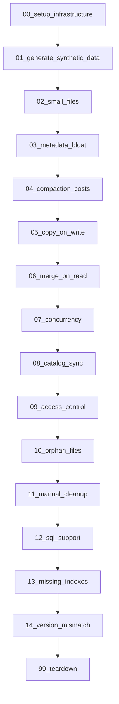

# Plan: Iceberg Production Challenges Demo (Elaborated)

## Overview

Create a folder of 15 separate SQL files that together form a complete, production-grade demo. The setup is fully elaborated with IAM policy JSON, trust relationships, and verification queries. Each challenge gets its own runnable file.

---

## File Structure

```
/Users/bsuresh/Documents/Projects/iceberg_challenge/
├── README_DEMO.md                          -- Instructions and challenge mapping
├── 00_setup_infrastructure.sql             -- External volume, IAM, DB, schema, warehouse, roles
├── 01_generate_synthetic_data.sql          -- Stored proc + initial data load (simulate streaming)
├── 02_challenge_small_files.sql            -- Challenge 1: Small file accumulation
├── 03_challenge_metadata_bloat.sql         -- Challenge 2: Metadata file bloating
├── 04_challenge_compaction_costs.sql       -- Challenge 3: Compaction compute costs
├── 05_challenge_copy_on_write.sql          -- Challenge 4: Copy-on-Write latency
├── 06_challenge_merge_on_read.sql          -- Challenge 5: Merge-on-Read penalties
├── 07_challenge_concurrency.sql            -- Challenge 6: Commit concurrency conflicts
├── 08_challenge_catalog_sync.sql           -- Challenge 7: Catalog synchronization drift
├── 09_challenge_access_control.sql         -- Challenge 8: Fragmented access control
├── 10_challenge_orphan_files.sql           -- Challenge 9: Orphan file accumulation
├── 11_challenge_manual_cleanup.sql         -- Challenge 10: Manual storage cleanup
├── 12_challenge_sql_support.sql            -- Challenge 11: Inconsistent SQL support
├── 13_challenge_missing_indexes.sql        -- Challenge 12: Missing platform indexes
├── 14_challenge_version_mismatch.sql       -- Challenge 13: Format version mismatches
└── 99_teardown.sql                         -- Cleanup all demo objects
```

---

## Detailed File Specifications

### 00\_setup\_infrastructure.sql (Elaborate Setup)

This is the most detailed file. It walks through the full infrastructure setup from scratch.

**Part A: AWS IAM Configuration (as comments with JSON)**

```
-- Step 1: Create an IAM policy for Snowflake Iceberg access
-- Save the following policy in AWS IAM Console:
/*
{
    "Version": "2012-10-17",
    "Statement": [
        {
            "Effect": "Allow",
            "Action": [
                "s3:PutObject",
                "s3:GetObject",
                "s3:GetObjectVersion",
                "s3:DeleteObject",
                "s3:DeleteObjectVersion",
                "s3:ListBucket",
                "s3:GetBucketLocation"
            ],
            "Resource": [
                "arn:aws:s3:::<bucket-name>/*",
                "arn:aws:s3:::<bucket-name>"
            ]
        }
    ]
}
*/

-- Step 2: Create IAM Role with trust policy placeholder
/*
{
    "Version": "2012-10-17",
    "Statement": [
        {
            "Effect": "Allow",
            "Principal": {
                "AWS": "<STORAGE_AWS_IAM_USER_ARN from DESCRIBE EXTERNAL VOLUME>"
            },
            "Action": "sts:AssumeRole",
            "Condition": {
                "StringEquals": {
                    "sts:ExternalId": "<STORAGE_AWS_EXTERNAL_ID from DESCRIBE EXTERNAL VOLUME>"
                }
            }
        }
    ]
}
*/
```

**Part B: Snowflake Object Creation**

```sql
-- Variables (user must set these)
SET s3_bucket_url = 's3://<YOUR-BUCKET>/iceberg-demo/';
SET iam_role_arn = 'arn:aws:iam::<ACCOUNT-ID>:role/<ROLE-NAME>';

-- Create External Volume
CREATE OR REPLACE EXTERNAL VOLUME iceberg_demo_vol
  STORAGE_LOCATIONS = (
    (
      NAME = 'aws-s3-iceberg-demo'
      STORAGE_PROVIDER = 'S3'
      STORAGE_BASE_URL = $s3_bucket_url
      STORAGE_AWS_ROLE_ARN = $iam_role_arn
    )
  )
  ALLOW_WRITES = TRUE;

-- Retrieve IAM user ARN + External ID for trust policy
DESCRIBE EXTERNAL VOLUME iceberg_demo_vol;
-- User updates trust policy with the returned values

-- Verify connectivity
SELECT SYSTEM$VERIFY_EXTERNAL_VOLUME('iceberg_demo_vol');
```

**Part C: Database, Schema, Warehouse, Roles**

```sql
CREATE OR REPLACE DATABASE ICEBERG_CHALLENGES_DB;
CREATE OR REPLACE SCHEMA ICEBERG_CHALLENGES_DB.DEMO;
USE DATABASE ICEBERG_CHALLENGES_DB;
USE SCHEMA DEMO;

-- Create dedicated warehouse for demos
CREATE OR REPLACE WAREHOUSE ICEBERG_DEMO_WH
  WAREHOUSE_SIZE = 'MEDIUM'
  AUTO_SUSPEND = 60
  AUTO_RESUME = TRUE;

-- Roles for access control challenge
CREATE OR REPLACE ROLE iceberg_analyst_role;
CREATE OR REPLACE ROLE iceberg_engineer_role;
GRANT USAGE ON DATABASE ICEBERG_CHALLENGES_DB TO ROLE iceberg_analyst_role;
GRANT USAGE ON SCHEMA ICEBERG_CHALLENGES_DB.DEMO TO ROLE iceberg_analyst_role;
-- (More grants in challenge 09)
```

**Part D: Set account-level Iceberg defaults**

```sql
-- Set Iceberg version default for the database
ALTER DATABASE ICEBERG_CHALLENGES_DB SET ICEBERG_VERSION_DEFAULT = 3;
-- Show current value
SHOW PARAMETERS LIKE 'ICEBERG_VERSION_DEFAULT' IN DATABASE ICEBERG_CHALLENGES_DB;
```

---

### 01\_generate\_synthetic\_data.sql

Creates a stored procedure that generates IoT sensor data in small micro-batches to simulate streaming ingestion:

- **Table**: `sensor_readings` (device\_id, sensor\_type, reading\_value, event\_ts, region, quality\_flag)
- **Pattern**: 50 batches of 1000 rows each = 50,000 total rows inserted individually
- **Purpose**: Creates the "small file problem" organically
- Also creates a `customer_orders` table for DML-heavy challenges (updates/deletes/merges)

```sql
-- Create main Iceberg table with intentionally small TARGET_FILE_SIZE to show the problem
CREATE OR REPLACE ICEBERG TABLE sensor_readings (
    device_id VARCHAR(20),
    sensor_type VARCHAR(30),
    reading_value FLOAT,
    event_ts TIMESTAMP_NTZ,
    region VARCHAR(20),
    quality_flag INT
)
CATALOG = 'SNOWFLAKE'
EXTERNAL_VOLUME = 'iceberg_demo_vol'
BASE_LOCATION = 'sensor_readings'
TARGET_FILE_SIZE = '16MB';

-- Stored procedure: simulate_streaming_ingestion
CREATE OR REPLACE PROCEDURE simulate_streaming_ingestion(num_batches INT, rows_per_batch INT)
RETURNS VARCHAR
LANGUAGE SQL
AS
$$
DECLARE
  i INT DEFAULT 0;
BEGIN
  WHILE (i < num_batches) DO
    INSERT INTO sensor_readings
    SELECT
      'device_' || UNIFORM(1, 100, RANDOM())::VARCHAR,
      ARRAY_CONSTRUCT('temperature','pressure','humidity','vibration')[UNIFORM(0,3,RANDOM())],
      UNIFORM(0, 100, RANDOM()) + RANDOM()/1000000000000,
      DATEADD(second, UNIFORM(0, 86400, RANDOM()), '2024-01-01'::TIMESTAMP_NTZ),
      ARRAY_CONSTRUCT('us-east','us-west','eu-west','ap-south')[UNIFORM(0,3,RANDOM())],
      UNIFORM(0, 1, RANDOM())
    FROM TABLE(GENERATOR(ROWCOUNT => rows_per_batch));
    i := i + 1;
  END WHILE;
  RETURN 'Inserted ' || (num_batches * rows_per_batch)::VARCHAR || ' rows in ' || num_batches::VARCHAR || ' micro-batches';
END;
$$;

-- Execute: create small-file scenario
CALL simulate_streaming_ingestion(50, 1000);
```

---

### 02\_challenge\_small\_files.sql through 14\_challenge\_version\_mismatch.sql

Each challenge file follows this template:

```sql
/*
==============================================================================
  CHALLENGE [N]: [Challenge Name]
==============================================================================
  PROBLEM: [1-2 sentence description of the open-source Iceberg problem]
  
  SNOWFLAKE MITIGATION: [Feature name and how it solves it]
  
  KEY PARAMETERS:
    - [PARAMETER_NAME] = [value]
==============================================================================
*/

-- ============================================
-- STEP 1: Show the problem exists
-- ============================================
[Query showing current state / metrics]

-- ============================================
-- STEP 2: Apply Snowflake configuration
-- ============================================
[ALTER TABLE / parameter setting]

-- ============================================
-- STEP 3: Demonstrate the fix
-- ============================================
[Operations that benefit from the configuration]

-- ============================================
-- STEP 4: Verify mitigation
-- ============================================
[Proof query: monitoring view, explain plan, metrics]
```

**Challenge-specific details:**

| File                                | Key Demo Actions                                                                                                                              |
| ----------------------------------- | --------------------------------------------------------------------------------------------------------------------------------------------- |
| `02_challenge_small_files.sql`      | Show file count via `TABLE_STORAGE_METRICS`, then set `TARGET_FILE_SIZE = 'AUTO'` and `ENABLE_DATA_COMPACTION = TRUE`, wait, re-query metrics |
| `03_challenge_metadata_bloat.sql`   | Show manifest files metadata, explain manifest compaction is automatic and zero-cost                                                          |
| `04_challenge_compaction_costs.sql` | Query `ICEBERG_STORAGE_OPTIMIZATION_HISTORY` to show serverless compaction credits vs. Spark cluster costs                                    |
| `05_challenge_copy_on_write.sql`    | Run large UPDATE with `ICEBERG_MERGE_ON_READ_BEHAVIOR = 'DISABLED'` (time it), then with `'ENABLED'` (time it), compare                       |
| `06_challenge_merge_on_read.sql`    | Show that with merge-on-read enabled + compaction, read perf stays stable after many updates                                                  |
| `07_challenge_concurrency.sql`      | Run concurrent INSERT statements from multiple sessions (uses tasks or multi-statement), show zero commit failures                            |
| `08_challenge_catalog_sync.sql`     | Create externally-managed table, show `AUTO_REFRESH = TRUE` config, demonstrate `SYSTEM$GET_ICEBERG_TABLE_INFORMATION`                        |
| `09_challenge_access_control.sql`   | Create row access policy + masking policy, apply directly to Iceberg table, test with different roles                                         |
| `10_challenge_orphan_files.sql`     | Show `TABLE_STORAGE_METRICS`, explain automatic snapshot expiry handles orphans, compare with `DATA_RETENTION_TIME_IN_DAYS`                   |
| `11_challenge_manual_cleanup.sql`   | Demonstrate that snapshot expiry + data compaction are fully automatic; no cron jobs or Spark maintenance needed                              |
| `12_challenge_sql_support.sql`      | Run full DML suite: INSERT, UPDATE single row, DELETE with predicate, MERGE from staging, TRUNCATE, CTAS                                      |
| `13_challenge_missing_indexes.sql`  | Add `CLUSTER BY (region, event_ts)`, run before/after query with profiling, show scan reduction                                               |
| `14_challenge_version_mismatch.sql` | Show `ICEBERG_VERSION_DEFAULT`, create v2 and v3 tables, demonstrate deletion vectors only on v3, show interop                                |

---

### 99\_teardown.sql

```sql
-- Optional: remove all demo objects
DROP DATABASE IF EXISTS ICEBERG_CHALLENGES_DB;
DROP EXTERNAL VOLUME IF EXISTS iceberg_demo_vol;
DROP WAREHOUSE IF EXISTS ICEBERG_DEMO_WH;
DROP ROLE IF EXISTS iceberg_analyst_role;
DROP ROLE IF EXISTS iceberg_engineer_role;
```

---

## Execution Flow Diagram



---

## Critical Files

- `00_setup_infrastructure.sql` -- Full IAM policy, trust relationship, external volume, DB/schema/warehouse/roles
- `01_generate_synthetic_data.sql` -- Stored procedure creating the small-file scenario and test data
- `05_challenge_copy_on_write.sql` -- Most impactful demo: timed comparison of COW vs MOR with deletion vectors
- `09_challenge_access_control.sql` -- Shows native governance (row access + masking) on Iceberg tables
- `13_challenge_missing_indexes.sql` -- Demonstrates Automatic Clustering with before/after query profiles

---

## Verification Strategy

After running each file:

1. **Storage metrics**: `SELECT * FROM SNOWFLAKE.ACCOUNT_USAGE.TABLE_STORAGE_METRICS WHERE ...`
2. **Optimization history**: `SELECT * FROM SNOWFLAKE.ACCOUNT_USAGE.ICEBERG_STORAGE_OPTIMIZATION_HISTORY`
3. **Parameter inspection**: `SHOW PARAMETERS LIKE '%ICEBERG%' IN TABLE <table_name>`
4. **Query profile**: Use Snowsight query profile to show scan reduction after clustering
5. **Role-based verification**: Switch roles to test access policies

---

## Prerequisites

| Requirement       | Details                                                     |
| ----------------- | ----------------------------------------------------------- |
| Snowflake Edition | Enterprise or higher (row access policies, clustering)      |
| Role              | ACCOUNTADMIN (for external volume, parameter changes)       |
| AWS               | S3 bucket in same region, IAM role with trust policy        |
| Warehouse         | MEDIUM or larger recommended for data generation            |
| Time              | \~30 min for full demo (compaction is async, may need wait) |
